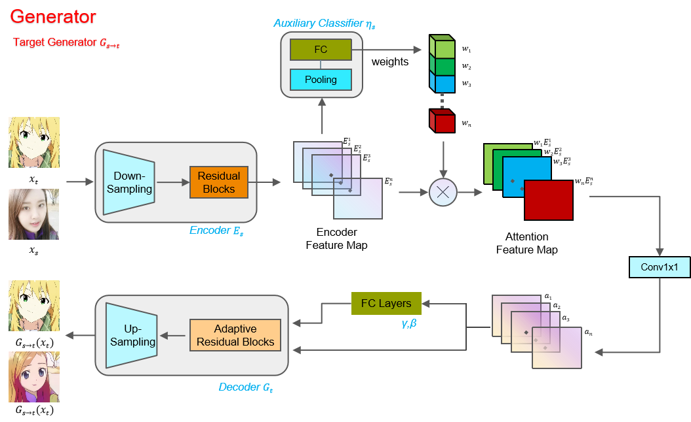
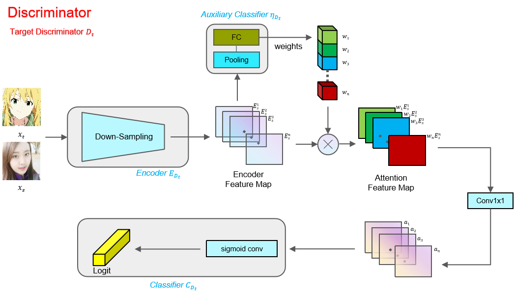
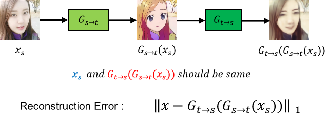

# U-GAT-IT 的重构版本

要做毕设的嘛，这个版本的代码正在跑了，**需要 Python 3.9**，这个代码的速度比原来的代码要快。

[原代码 Pytorch 版本](https://github.com/znxlwm/UGATIT-pytorch)

[原代码 TensorFlow 版本](https://github.com/taki0112/UGATIT)

其余的地方基本没变，修改的部分如下：

1. 在 model.py 中将各个模块分开了，如提取 BetaGamma 的模块，ClassActivationMapping 模块，都写了一个单独的 class，便于理解模型的架构
2. 将参数写在 config.yml 中，每次训练/测试都会读取这个文件，就不用配置 lunch.json 或者输入一大堆--batch_size 这种命令
3. 将损失传到 tensorboard 中，可以查看
4. 在验证阶段和训练的某些代码段中禁用梯度计算，减小显存的使用
5. 添加原文中的 **zero-centered normal distribution with a standard deviation of 0.02.**参数初始化

# 生成器和判别器的结构

原来论文中的图感觉不是特别的清楚，自己重画了个

1. 生成器

   

2. 判别器

   

# 循环一致性约束

# 显存占用

1. ch=64,light=False，显存占用 22G 左右
2. ch=64,light=True, 显存占用 10G 左右
3. ch=32,light=True，显存占用 5G 左右

## 显存占用分析

1. 检查发现，提取 Normalize 层的参数 Beta，Gamma 的时候使用全连接层，这个全连接层输入是将特征图展平，即 256\*64\*64，输出是 256，导致单单这个层的参数就是**1GB**，模型大小为 1.05G，非常不合理。

2. 他自己也提供了轻量化模型的选项，就是将特征图进行池化之后再丢进全连接层，这样显存就大大减少了。
